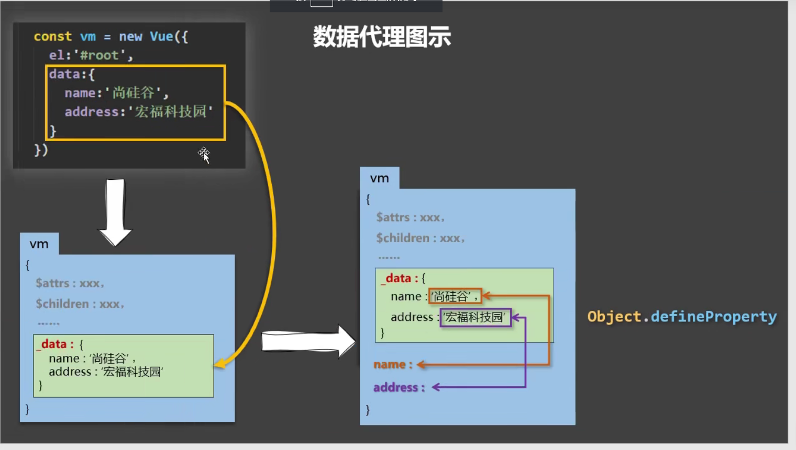

## Vue是基于MVVM
MVVM模型
			1. M：模型(Model) ：data中的数据
			2. V：视图(View) ：模板代码
			3. VM：视图模型(ViewModel)：Vue实例
观察发现：
			1.data中所有的属性，最后都出现在了vm身上。
			2.vm身上所有的属性 及 Vue原型上所有属性，在Vue模板中都可以直接使用。

### 1. Object.defineProperty()
给指定的对象添加属性，可设置添加的属性不被枚举
```js
 Object.defineProperty(person,'age',{
                /* value:18,
                enumerable:true,    //是否被枚举，默认false
                writable:true,       //是否可写，默认false
                configurable:true,      //是否可被删除，默认false */

                //当有人读取person的age属性时，get函数(getter)就会被调用，且返回值就是age的值
                get(){
                    console.log("有人调用get!");
                    return number;
                },
                //当有人修改person的age属性时，set函数(setter)就会被调用，且会收到修改的具体值
                set(value){
                    console.log("有人修改了age");
                    number = value;
                }
            })
```
### 1.2 数据代理
```js
//  数据代理：通过一个对象代理对另一个对象中属性的操作（读/写）
			let obj = {x:100}
			let obj2 = {y:200}

			Object.defineProperty(obj2,'x',{
				get(){
					return obj.x
				},
				set(value){
					obj.x = value
				}
			})
```            
写在Vue实例配置中的data被保存到了Vue实例._data属性中，因为采用了数据代理，再把data的数据放到实例上一份方便调用
#### 1.3 Vue中的数据代理：
							通过vm对象来代理data对象中属性的操作（读/写），实际上是读的改的data只给你的属性
				2.Vue中数据代理的好处：
							更加方便的操作data中的数据
				3.基本原理：
							通过Object.defineProperty()把data对象中所有属性添加到vm上。
							为每一个添加到vm上的属性，都指定一个getter/setter。
							在getter/setter内部去操作（读/写）data中对应的属性。



### 2.事件的基本使用：
		1.使用v-on:xxx 或 @xxx 绑定事件，其中xxx是事件名；
		2.事件的回调需要配置在methods对象中，最终会在vm上；
		3.methods中配置的函数，不要用箭头函数！否则this就不是vm了；
		4.methods中配置的函数，都是被Vue所管理的函数，this的指向是vm 或 组件实例对象；
		5.@click="demo" 和 @click="demo($event)" 效果一致，但后者可以传参；
			$event写第一个参数第n个参数都行，是一个关键词
### 2.1事件修饰符
Vue中的事件修饰符：
		1.prevent：阻止默认事件（常用）；
		2.stop：阻止事件冒泡（常用）；
		3.once：事件只触发一次（常用）；
		4.capture：使用事件的捕获模式；
		5.self：只有event.target是当前操作的元素时才触发事件；
```html
			<!-- 只有event.target是当前操作的元素时才触发事件； 只有是这个div时，才会触发这个div绑定的点击回调-->
			<div class="demo1" @click.self="showInfo">
				<button @click="showInfo">点我提示信息</button>
			</div>
```
		6.passive：事件的默认行为立即执行，无需等待事件回调执行完毕；
			比如绑定wheel事件滚动滚轮，先触发回调事件，执行回调函数，执行完回调函数之后滚轮才动。
				如果滚动需要处理繁琐的代码，等执行完滚轮才会动，体验效果太差，往往移动端会这样处理优化一下
	修饰符是可以连着写的
### @wheel与@scroll，前者只会监控鼠标滚轮的动作，后者是监控页面滚动条的动作

### 2.2.Vue中常用的按键别名：
			回车 => enter
			删除 => delete (捕获“删除”和“退格”键)
			退出 => esc
			空格 => space
			换行 => tab (特殊，必须配合keydown去使用)
			上 => up
			下 => down
			左 => left
			右 => right

2.Vue未提供别名的按键，可以使用按键原始的key值去绑定，但注意要转为kebab-case（短横线命名）

3.系统修饰键（用法特殊）：ctrl、alt、shift、meta
			(1).配合keyup使用：按下修饰键的同时，再按下其他键，随后释放其他键，事件才被触发。
				比如同时按下ctrl+r，松开r才会触发ctrl绑定的回调函数
			(2).配合keydown使用：正常触发事件。

4.也可以使用keyCode去指定具体的按键（不推荐）
	因为不同的键盘他的编码不统一，用按键名字比较方便
		该特性已经从 Web 标准中删除，虽然一些浏览器目前仍然支持它，但也许会在未来的某个时间停止支持，请尽量不要使用该特性。
5.Vue.config.keyCodes.自定义键名 = 键码，可以去定制按键别名

	也可以连着写@keyup.ctrl.y

### 3.data中的数据发生改变，模板会被重新解析，模板中插值进去的函数，会被再次执行
```js
<h2>{{fullName()}}</h2>
fullName执行的结果当做被插的值插进h2
```

### 3.1 computed属性中的值是有data计算得来的，所以在vm._data中不会出现计算属性。_data中的属性拿出来计算然后直接给挂vm上了。
	Vue对于计算属性有一个缓存机制，当第一次读取计算属性时会存到缓存里，下次就不用调用get了
1.定义：要用的属性不存在，要通过已有属性计算得来。
				2.原理：底层借助了Objcet.defineproperty方法提供的getter和setter。
				3.get函数什么时候执行？
							(1).初次读取时会执行一次。
							(2).当依赖的数据发生改变时会被再次调用。
				4.优势：与methods实现相比，内部有缓存机制（复用），效率更高，调试方便。
				5.备注：
						1.计算属性最终会出现在vm上，直接读取使用即可。
						2.如果计算属性要被修改，那必须写set函数去响应修改，且set中要引起计算时依赖的数据发生改变。
				计算属性里的getter和setter也是由Vue管理的函数，一定不要写箭头函数，一旦写了箭头函数，this就不再是Vue实例了。
                    只能使用普通函数，不能使用箭头函数，因为this的指向问题，
#### 计算属性简写
当不考虑被修改的情景下，也就是说不用写setter时才用简写
````js
fullName(){
	return this.firstName+'-'+this.lastName;
}
直接以函数的形式，这个函数就是getter
表面上是一个函数，实际上是执行了这个函数然后被返回值给到了vm.fullName
```